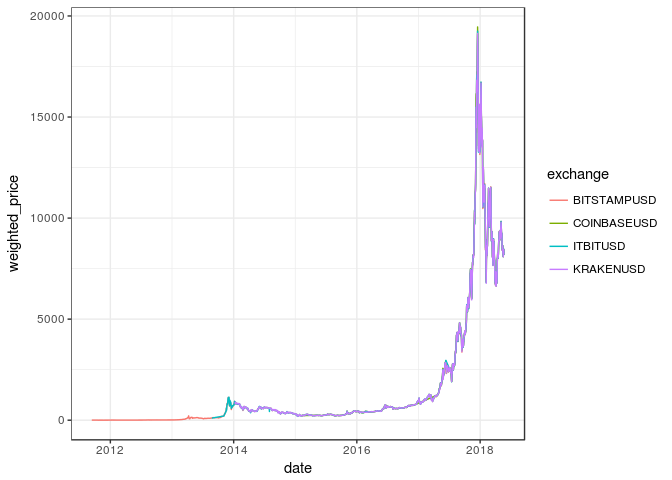
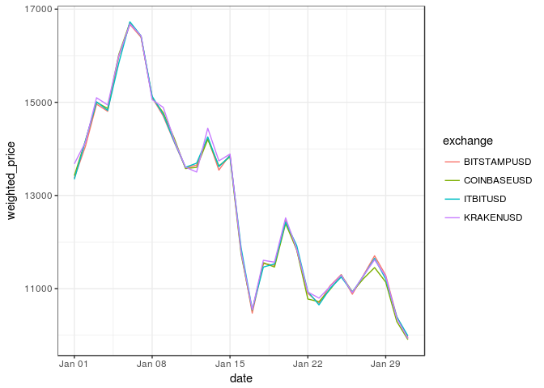
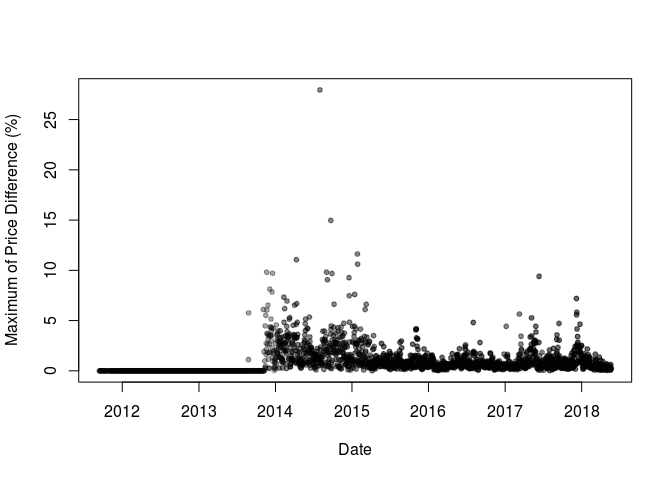
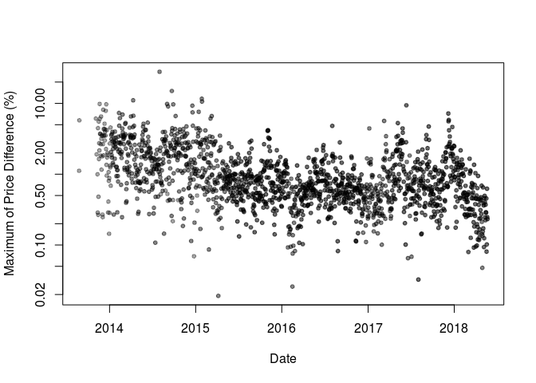
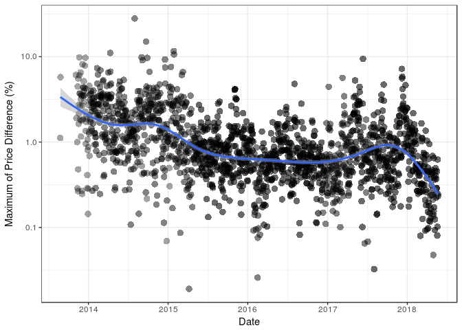
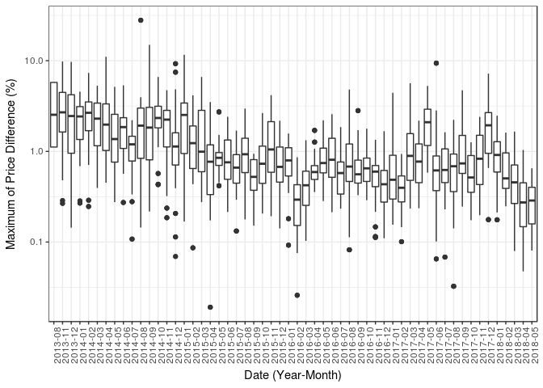
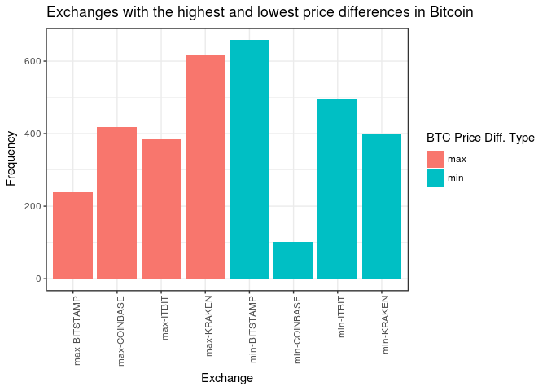

No doubt that crypto currencies with all the promises they bring, both financially and otherwise, are only here to stay. As a data scientist interested in data and numbers, I thought it would be nice to take a look at some crypto currencies with my favorite tool, [R](https://cran.r-project.org/).

R Libraries
-----------

Below is a list of R libraries we will be using to help us with our analysis. Not all of them are necessary but they all will make our life easier.

``` r
library(PoloniexR)
library(data.table)
library(lubridate)
library(Quandl)
library(plyr)
library(stringr)
library(ggplot2)
library(plotly)
library(janitor)
library(quantmod)
library(pryr)
library(corrplot)
library(PerformanceAnalytics)
library(tidyr)
library(MLmetrics)
library(readr)
library(knitr)
```

Getting the Data
----------------

### 1. PoloniexR Package

The easiest way to get current and historical data for cyrpto currencies is by using the [PoloniexR](https://cran.r-project.org/web/packages/PoloniexR/index.html) developed by Vermeir Jellen. Vermeir Jellen gives a good tutorial on how to start with his package [here](https://github.com/VermeirJellen/PoloniexR). The [Poloniex exchange](https://poloniex.com/exchange) includes many coins but not all. For missiong coins on Poloniex, one can scrape the [coinmarketcap](www.coinmarketcap.com) page, an example is given here.

### 2. Quandl

[Quandl](https://www.quandl.com) is my go to place for any financial data. Their free-tier API has lots of good data one can use. Quandl offers data from multiple exchanges. Locating crypto data on Quandl is not straight forward. After spending few hours on their site I found out that most of the crypto data can be found [here](https://www.quandl.com/data/BITFINEX-Bitfinex)

First, let's take a look at different exchange data for Bitcoin using Quandl. We will download and plot historical bitcoin data from the following exchanges Kraken, Coinbase, Bitstamp, and ITBIT

``` r
# enable your Quandl API key
my_quandl_api_key <- read_file("../../quandl_api_key.txt")
Quandl.api_key(my_quandl_api_key)

# function to download quandl data
get_quandl_data <- function(data_source = "BITFINEX"
                            , pair = 'btcusd'
                            , ...){
  
  # make sure the user supplied the correct data_source
  if(toupper(data_source) != "BITFINEX") stop("data source supplied is wrong...")
  # quandl is case sensitive, all codes have to be upper case
  pair <- toupper(pair)
  tmp <- NA
  try(tmp <- Quandl(code = toupper(paste(data_source, pair, sep = "/")), ...), silent = TRUE)
  return(tmp)
}

# get btc data from different exchanges

  exchange_data <- list()
  
  exchanges <- c('KRAKENUSD','COINBASEUSD','BITSTAMPUSD','ITBITUSD')
  
  for (i in exchanges){
    exchange_data[[i]] <- Quandl(paste0('BCHARTS/', i))
  }
```

We need to convert this list of BTC prices from different exchanges into a dataframe and put them all in one data frame so we can plot them.

``` r
# put them all in one dataframe to plot in ggplot2
btc_usd <- do.call("rbind", exchange_data)
btc_usd$exchange <- row.names(btc_usd)
btc_usd <- as.data.table(btc_usd)
```

We also need to do some minor cleaning, so let's do that. We also need to get rid of rows of data with 0 weighted price.

``` r
# some data cleaning
btc_usd[, exchange := as.factor(str_extract(exchange, "[A-Z]+"))]
btc_usd <- clean_names(btc_usd)
btc_usd <- btc_usd[weighted_price > 0]

# set datatable key to be the date column
setkey(btc_usd, date)
```

Let's take a look at the data table we just made.

``` r
knitr::kable(head(btc_usd))
```

| date       |  open|  high|   low|  close|  volume\_btc|  volume\_currency|  weighted\_price| exchange    |
|:-----------|-----:|-----:|-----:|------:|------------:|-----------------:|----------------:|:------------|
| 2011-09-13 |  5.80|  6.00|  5.65|   5.97|     58.37138|          346.0974|         5.929231| BITSTAMPUSD |
| 2011-09-14 |  5.58|  5.72|  5.52|   5.53|     61.14598|          341.8548|         5.590797| BITSTAMPUSD |
| 2011-09-15 |  5.12|  5.24|  5.00|   5.13|     80.14080|          408.2590|         5.094272| BITSTAMPUSD |
| 2011-09-16 |  4.82|  4.87|  4.80|   4.85|     39.91401|          193.7631|         4.854515| BITSTAMPUSD |
| 2011-09-17 |  4.87|  4.87|  4.87|   4.87|      0.30000|            1.4610|         4.870000| BITSTAMPUSD |
| 2011-09-18 |  4.87|  4.92|  4.81|   4.92|    119.81280|          579.8431|         4.839576| BITSTAMPUSD |

The data includes 10 columns, the date, OCHL prices, volumes in USD and BTC, the weighted price, and the exchange. I wish I had bought me some bitcoine back in 2011!!!

Now we'll look at the price of bitcoin and color code it by exchange.

``` r
ggplot(btc_usd, aes(x = date, y = weighted_price, col = exchange)) + geom_line() + theme_bw()
```

 \#\# Arbitrage

It appears the prices of btc on different exchanges are fairly consisant. But this is an artifact in the figure since we are covering several orders of magnitudes during the timeline we selected. To better see any price differenes we need to zoon in on the figure. Let's zoom in on, say the first month of 2018, were we had the ATH for all coins. This will enable us to better see any differences in prices.

``` r
ggplot(btc_usd[date >= ymd("2018-01-01") & date <= ymd("2018-01-31")], aes(x = date, y = weighted_price, col = exchange)) + geom_line() + theme_bw()
```



There are obvious differences in prices between the exchanges. Differences seem to vary over time as well. Actually it will be interesting to look at the maxiumum price differences as a function of time, let's do that

``` r
# first let's find the minimum price by date
btc_usd[, min_price := min(weighted_price), by = date]

# now we need to find the price difference between the price for each day and the minimum price for that day
# but since the price of bitcoin varies a lot for the time period under study, we need to normalize the price difference
# to do that we will just divide by the median price for each day
btc_usd[, price_diff := 100*(weighted_price - min_price)/median(weighted_price), by = (date)]
```

Now we have a new column which gives us the percentage of price differences for each day normalized to the median price for each day. Let's take a look at the new table.

``` r
knitr::kable(tail(btc_usd))
```

| date       |     open|     high|      low|    close|  volume\_btc|  volume\_currency|  weighted\_price| exchange    |  min\_price|  price\_diff|
|:-----------|--------:|--------:|--------:|--------:|------------:|-----------------:|----------------:|:------------|-----------:|------------:|
| 2018-05-21 |  8518.64|  8589.10|  8320.00|  8391.76|     6126.971|          51780405|         8451.224| BITSTAMPUSD |    8443.584|    0.0904401|
| 2018-05-21 |  8525.00|  8603.27|  8301.06|  8403.28|     2834.383|          23991560|         8464.472| ITBITUSD    |    8443.584|    0.2472616|
| 2018-05-22 |  8390.80|  8408.00|  7938.40|  7992.30|     3867.748|          31722893|         8201.902| KRAKENUSD   |    8182.840|    0.2326673|
| 2018-05-22 |  8393.43|  8400.00|  7950.00|  7997.86|     6244.524|          51136173|         8188.962| COINBASEUSD |    8182.840|    0.0747270|
| 2018-05-22 |  8403.23|  8417.65|  7951.41|  7982.67|     8723.563|          71509826|         8197.318| BITSTAMPUSD |    8182.840|    0.1767173|
| 2018-05-22 |  8400.05|  8408.29|  7955.53|  7971.78|     2540.633|          20789596|         8182.840| ITBITUSD    |    8182.840|    0.0000000|

The reason I looked at the newer dates is that prior to 2014 we only have data for one exchange, so all the price differences were 0. Let's take a look at the price differences as a function of time.

``` r
# first we need to create a new data table with only the maxiumum prices per day
tmp <- btc_usd[, price_diff := max(price_diff), by = date]

# This will help us visualize overlapping points
MyGray <- rgb(t(col2rgb("black")), alpha=50, maxColorValue=255)
tmp[, plot(date, price_diff, pch=20, col = MyGray, xlab = "Date", ylab = "Maximum of Price Difference (%)")]
```



    ## NULL

Let's show the plot with log scale on y axis. Let's also discard dates with zero price differences.

``` r
tmp[price_diff > 0, plot(date, price_diff, pch=20, col = MyGray, log = "y" , xlab = "Date", ylab = "Maximum of Price Difference (%)")]
```



    ## NULL

As one can see from the figure above, the bulk of the maximum difference in bitcoin prices between the different exchanges is in the 0.5-2.0% range. It is also interesting to see that the differences in prices seem to have come down between 2014 and 2016, but they seem to go up starting in 2017. Let's fit a gam model to see what we get.

``` r
# we'll use ggplot and fit a gam smooth line
ggplot(tmp[price_diff > 0 ], aes(x = date, y = price_diff)) + geom_point(alpha = 0.2, shape = 16, size = 3, show.legend = FALSE) + scale_y_continuous(trans='log10') + geom_smooth(method = "gam", formula = y ~ s(x, bs = "cs")) + theme_bw() + xlab("Date") + ylab("Maximum of Price Difference (%)")
```



The regression line shows a hint of an over all downtrend from 2014 to mid 2016, except for an uptrend for few months in late 2015. The trend seems to have gone up in mid to late 2017, and again we see a downword movement in price differences starting in December of 2017. This can be seen better in the box-plot figure below.

``` r
tmp[, month_year := format(as.Date(date), "%Y-%m")]
ggplot(tmp[price_diff > 0], aes(x = month_year, y = price_diff)) + geom_boxplot() + scale_y_continuous(trans='log10') + xlab("Date (Year-Month)") + ylab("Maximum of Price Difference (%)") + theme_bw() + theme(axis.text.x = element_text(angle = 90, hjust = 1))
```



The box-plot figure above shows the variation of maximum differences in prices as a function of time. On the x-axis I grouped dates by month since anything less than a one-month period will result in congested figure.

Okay, now let's find out which of the exchanges contribute the most to these price difference. That is, we are trying to determine which exchanges are constantly selling bitcoin higher, or lower, than the rest of the exchanges. We need to pull some numbers as below, and then we'll make a bar plot to show the leading exchanges in each category.

``` r
# add two columns to our data table which will contain the minimum and maximum prices
tmp[, `:=`(day_max = max(weighted_price), day_min = min(weighted_price)), by = date]

# now put only the columns we care about in a new data.table
tmp2 <- tmp[price_diff > 0 , .(date, exchange, weighted_price, day_min, day_max)]

# notice how we excluded days with no price difference
# now we only want to keep the rows with the maximum and minimum daily prices
tmp2 <- tmp2[weighted_price == day_min | weighted_price == day_max]

# now we'll add a new column designating the price as being the minimum or maximum
tmp2[, max_min := ifelse(weighted_price == day_min, "min", "max")]

# clean the name of the exchange
tmp2[, exchange := gsub("USD", "", exchange)]

# now we'll add a new column containing the exchange name and the min_max column
tmp2[, max_min_exchange := paste(max_min, exchange, sep = "-")]
```

In the above chunk of code we created a new table which contains the maximum and minimum prices for each day. The table also contains a categorical column showing to which exchange this max/min price belong, and if the price was a maxima or a minima. Before we plot the table above, let's have a quick look at it.

``` r
knitr::kable(head(tmp2))
```

| date       | exchange |  weighted\_price|  day\_min|  day\_max| max\_min | max\_min\_exchange |
|:-----------|:---------|----------------:|---------:|---------:|:---------|:-------------------|
| 2013-08-25 | BITSTAMP |         111.5484|  110.3100|  111.5484| max      | max-BITSTAMP       |
| 2013-08-25 | ITBIT    |         110.3100|  110.3100|  111.5484| min      | min-ITBIT          |
| 2013-08-26 | BITSTAMP |         112.1077|  105.8300|  112.1077| max      | max-BITSTAMP       |
| 2013-08-26 | ITBIT    |         105.8300|  105.8300|  112.1077| min      | min-ITBIT          |
| 2013-11-04 | BITSTAMP |         220.4782|  207.4124|  220.4782| max      | max-BITSTAMP       |
| 2013-11-04 | ITBIT    |         207.4124|  207.4124|  220.4782| min      | min-ITBIT          |

The max\_min\_exchange column contains all the data we need, so let's make a barplot of this variable, we'll color the barplot by the max\_min criteria shown in max\_min column

``` r
# now make a barplot 
ggplot(tmp2, aes(x = max_min_exchange, fill = max_min)) + geom_bar() + theme_bw() + theme(axis.text.x = element_text(angle = 90, hjust = 1)) + ggtitle("Exchanges with the highest and lowest price differences in Bitcoin") + ylab("Frequency") + xlab("Exchange") + scale_fill_discrete(name = "BTC Price Diff. Type")
```



This is interesting, Kraken seems to be the exchange with the most frequent highest prices for bitcoin. On the other hand, Bitstamp seems to be the one with the most frequent lowest prices among exchanges. So if you want to do [arbitrage](https://www.investopedia.com/terms/a/arbitrage.asp) your best bit is to buy on Bitstamp and sell on Kraken.
