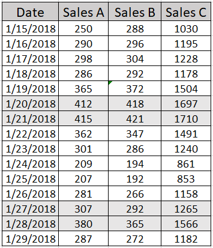
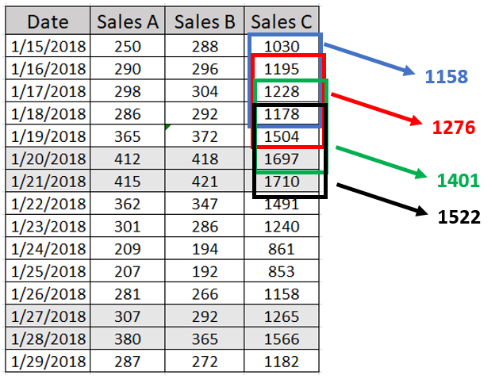
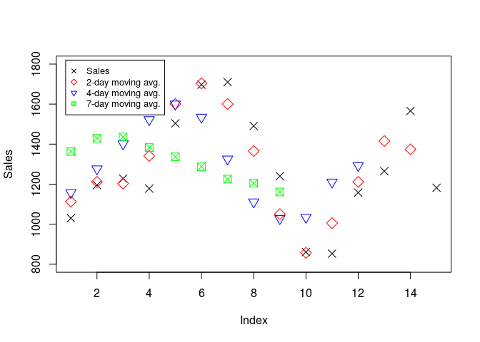

In my two previous posts, [Downloading and Processing Crypto Data with R](http://rpubs.com/aousabdo/crypto_1) and [Corrleations in the Crypto World Part 1](http://rpubs.com/aousabdo/crypto_2) I went over how one can download crypto data in R and talked about static correlations for some coins. In this post, we will cover rolling correlatoins, a type of correlations we use with time-series data like crypto data.

R Libraries
-----------

Below is a list of R libraries we will be using to help us with our analysis. Not all of them are necessary but they all will make our life easier.

``` r
library(PoloniexR)
library(data.table)
library(lubridate)
library(Quandl)
library(plyr)
library(stringr)
library(ggplot2)
library(plotly)
library(janitor)
library(quantmod)
library(pryr)
library(corrplot)
library(PerformanceAnalytics)
library(tidyr)
library(MLmetrics)
library(tidyquant)
library(corrr)
library(cowplot)
library(knitr)
library(zoo)
```

Rolling Correlations
--------------------

Establishing a relationship, in this case a correlation, between two time series can be very benificial for several reasons, the most important of which is to being able to use this relationship/correlation to predict market movement, which if you can get right then you'll be rich. Established correlations between the price of a crypto currency, for example, with other time series data such as market sentiment, news, or the price of another crypto currency, can be used to better forecast the movement of that coin or stock. But as we have seen in the previous [post](http://rpubs.com/aousabdo/crypto_2), one problem exists, these correlations are not static and they could vary greatly overtime.

Rolling correlations are similar to [moving averages](https://www.investopedia.com/university/movingaverage/movingaverages1.asp), they are metrics we apply over a time window to better see potential trends and avoid the noise in the data. Since this might be a new topic for some readers let's elaborate more.

Suppose we have a dataset which reflects daily sales for a department store for three products, A, B, and C. The sales for these products are shown in the table below.



One can see from the table that sales for a given product vary over time, with the greatest sales taking place over the weekend, Jan 20-21 and 27-28 in the sample shown. Let's calculate the moving average for product C over a period of 4 days for example. To calculate the moving average, or any rolling function, we first have to select a time window, in this case we selected 4 days. After that we apply the function, in this case calculating the average over the selected time window. Once that is done we shift the window by one unit, one day in this case, and reapply the function and so on. The figure below shows the moving averages for Product C over a period of 4 days.



``` r
# sales for product C
prod_c <- c(1030, 1195, 1228, 1178, 1504, 1697,1710 ,1491 ,1240 , 861, 853, 1158, 1265, 1566,1182)

# calculate 3 moving averages for time windows of 2, 4, and 7 days
sma2 <- rollmean(prod_c, k = 2)
sma4 <- rollmean(prod_c, k = 4)
sma7 <- rollmean(prod_c, k = 7)

# plot sales and overlay the moving averages
plot(prod_c, pch=4, col = "black", xlab = "Index", ylab = "Sales")
points(sma2, col = "red", pch=20)
points(sma4, col = "blue", pch=20)
points(sma7, col = "green", pch=20)

# add legend
legend(1, 1700, legend=c("Sales", "SMA2", "SMA4", "SMA7"),
       col=c("black", "red", "blue", "green"),  pch = c(4, rep(20, 3)), cex=0.8)
```



Notice how increasing the time window helps us get rid of the noise in the data. This is evident from the smoother curves for the moving averages with time windows of 4 and 7. It is also worth noting that increasing the time window decreases the number number of retunred moving averages. This implies that a moving average over the whole period will result in just one number, which is simply the average over the whole period.
